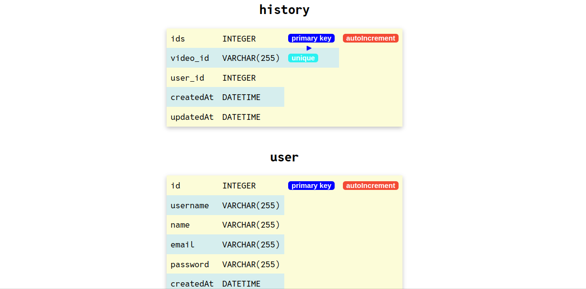

# db-drawer

a cli tool for visualising your database schemas. db-drawer checks the data model schemas of your project ("./models") folder and visualises by running on localhost in node environment. it attaches to your project as an npm package.

currently, we have support only for sequelize and mongoose.

refer to Learn.md for building the project: <a href="https://github.com/Bhanu-code/db-drawer/blob/main/Learn.md">Learn.md</a>

video demonstration of the project: <a href="https://youtu.be/bcp6hE_R75U?si=Rd8dj-SLtZwtVjwH">Demonstration video</a>

Join Our Discord channel: <a href="https://discord.gg/hMQcQcng">Discord</a>


## Installation

Install db-drawer with npm

```javascript
//install using npm
npm install -g db-drawer
//open terminal and type
//for sequelize
db-draw s
//for mongoose
db-draw m
// hit enter and it will run localhost where you can see your schema, relationship and constraints in a tablular format
```
    
## Screenshots




## Local Setup

Note: [ Don't commit to main branch, always create a seprate branch before raising PR ]

```javascript
// You will need a demo project that has "/models" folder to see your models visualised.
//To setup the project locally, for the repository and copy the forked copy the https url
//in the terminal write
git clone [repo-url]
cd db-drawer
npm install
// have a project that has "models" folder
//install dbdrawer-mongo to the project globally
npm install -g 
// Open the demo project
//run the command for sequelize
db-draw s
//run the command for mongoose
db-draw m

// hit enter and it will run localhost where you can see your schema, relationship and constraints in a tablular format
//create a branch, make changes and raise PR
```


## Contributing

Contributions are always welcome!

See `contributing.md` for ways to get started.

Please adhere to this project's `code of conduct`.


## License

[MIT License](LICENSE)

